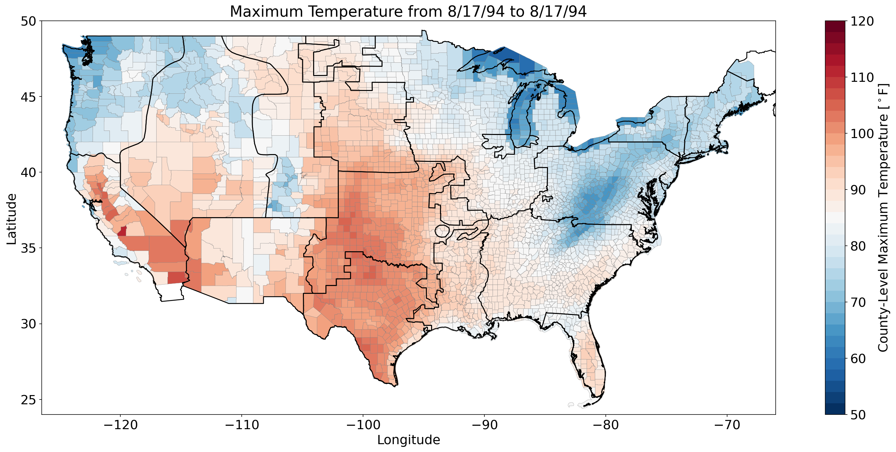
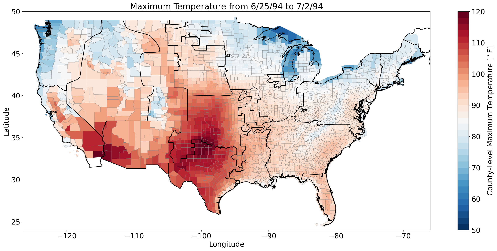
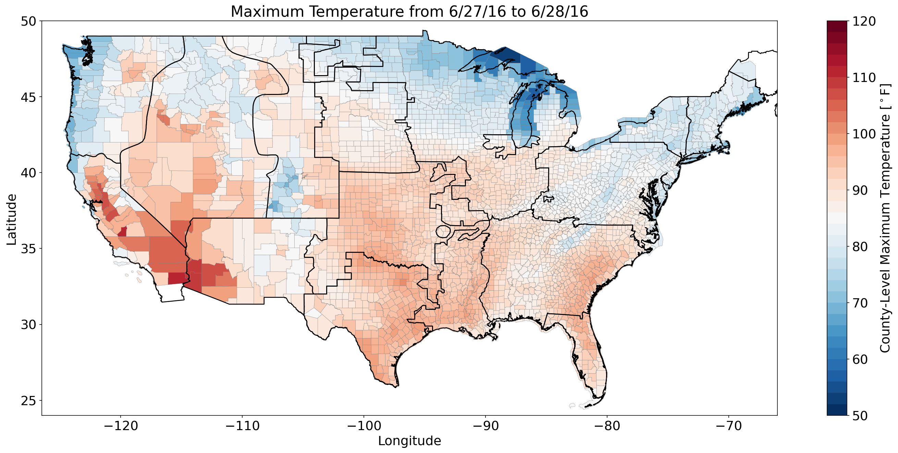
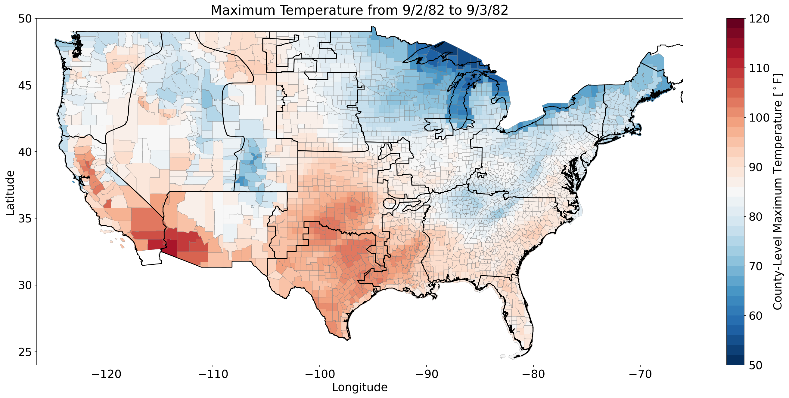
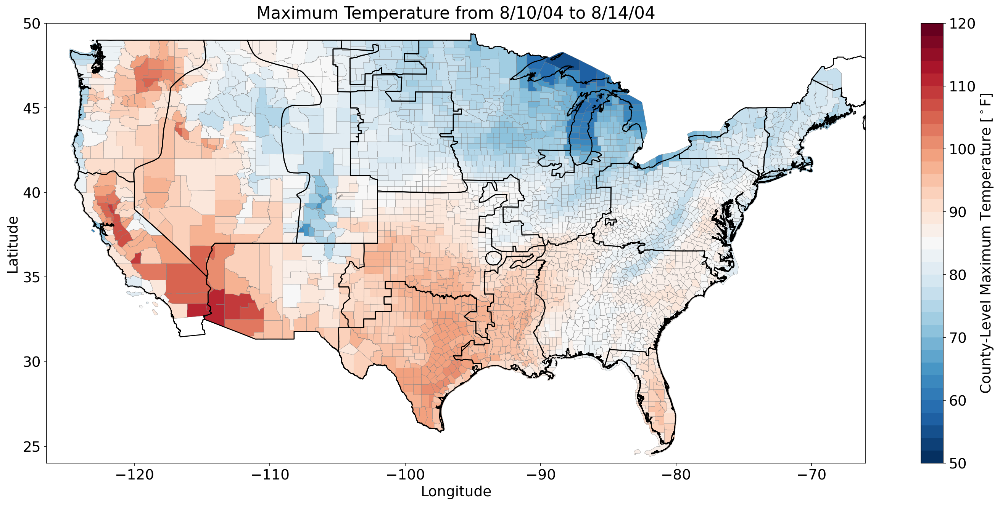
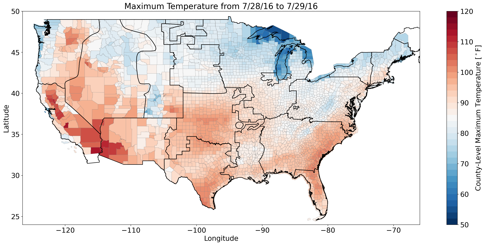

# Case Studies
This page contains more detailed background plots that describe each of the three case studies presented in the paper.      
>
|       Case Study        |  Label  |   Focus Region    |                            Maximum Temperature Map                            |
|:-----------------------:|:-------:|:-----------------:|:-----------------------------------------------------------------------------:|
|     Event Duration      | ED1-RM  |  Rocky Mountains  |   |
|     Event Duration      | ED2-RM  |  Rocky Mountains  |   |
| Hydropower Contribution | HC1-CA  |    California     |   |
| Hydropower Contribution | HC2-CA  |    California     |   |
|     Spatial Extent      | SE1-PNW | Pacific Northwest |  | 
|     Spatial Extent      | SE2-PNW | Pacific Northwest |  | 