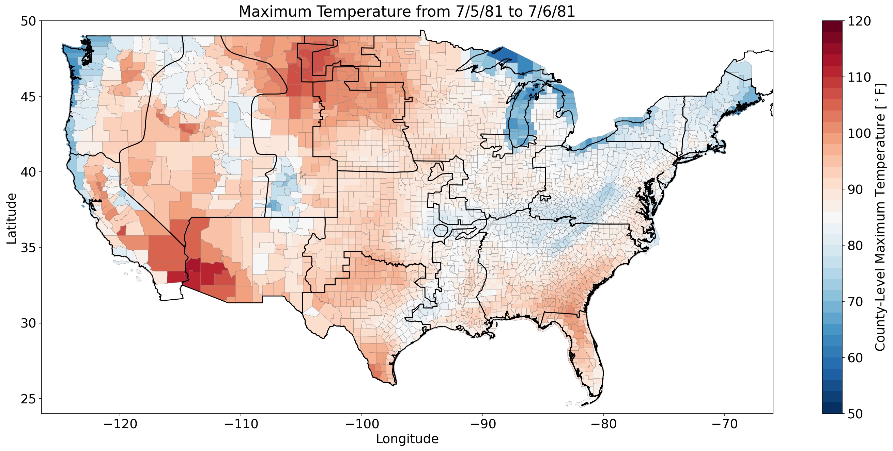
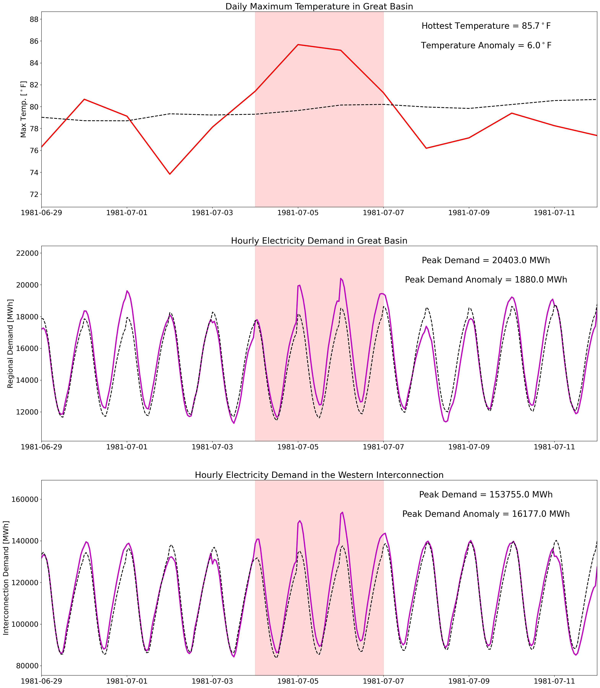
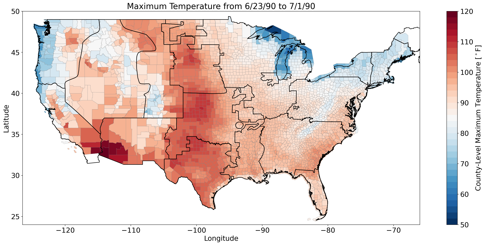
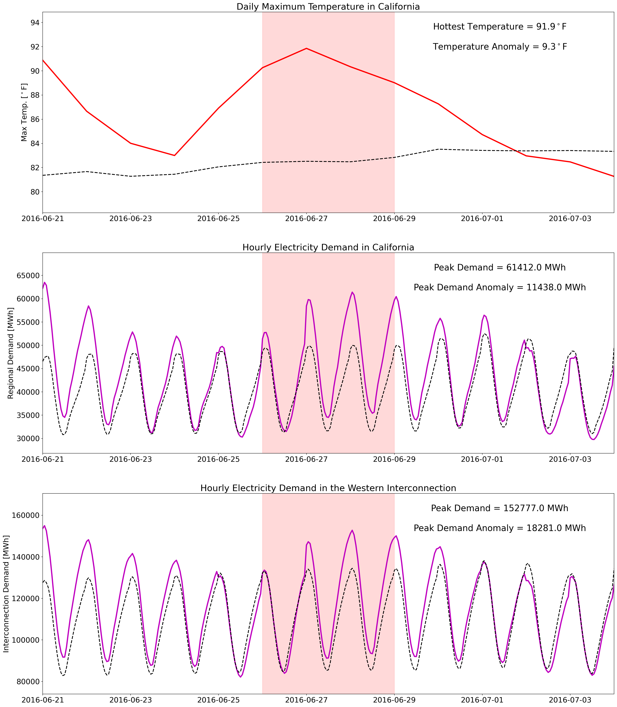
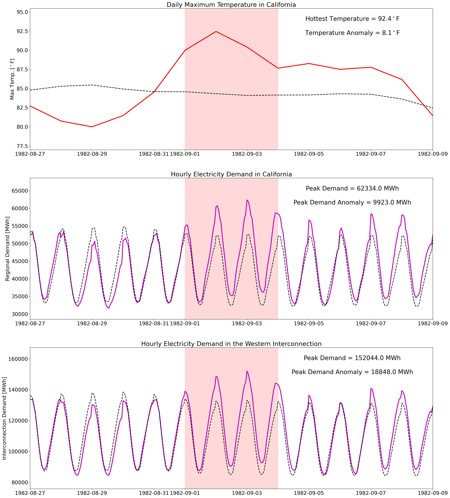
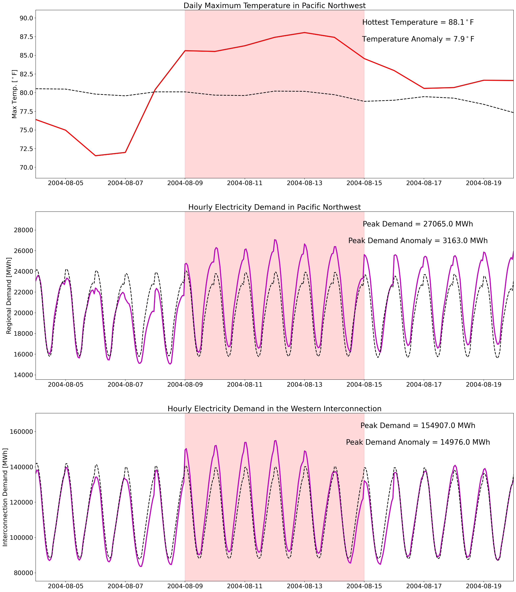
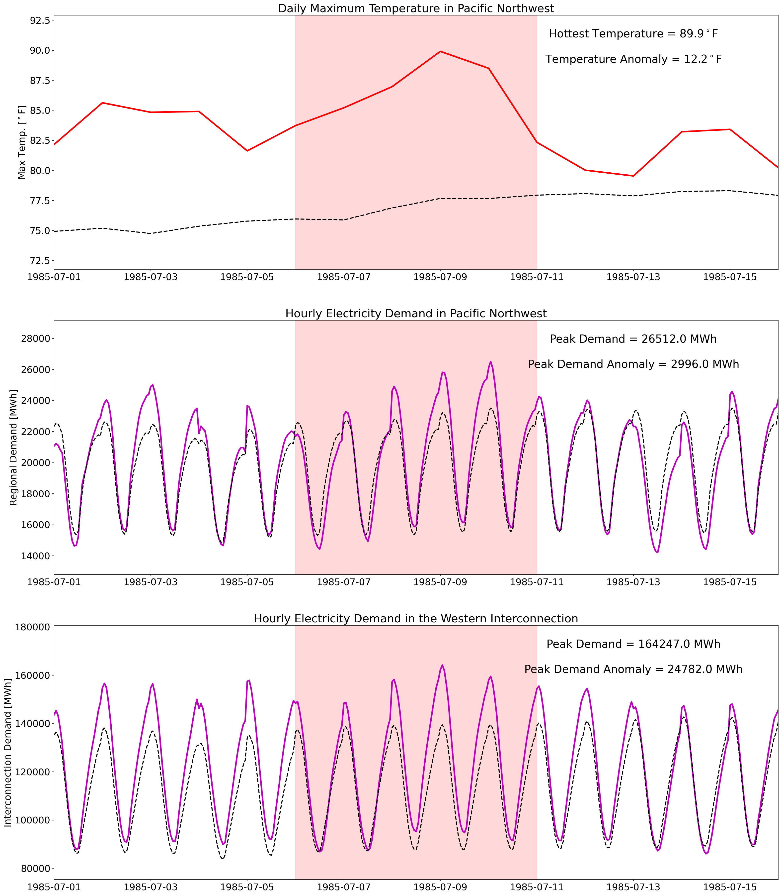

# Case Studies
This page contains background plots that provide context for each of the three case studies presented in the paper.      
>
|       Case Study        |  Label  |   Focus Region    |                              Max Temperature Map                              |                       Temperature-Load Time Series                        |
|:-----------------------:|:-------:|:-----------------:|:-----------------------------------------------------------------------------:|:-------------------------------------------------------------------------:|
|     Event Duration      | ED1-GB  |    Great Basin    |   |   |
|     Event Duration      | ED2-GB  |    Great Basin    |   |   |
| Hydropower Contribution | HC1-CA  |    California     |   |   |
| Hydropower Contribution | HC2-CA  |    California     |   |   |
|     Spatial Extent      | SE1-PNW | Pacific Northwest |  |  | 
|     Spatial Extent      | SE2-PNW | Pacific Northwest |  |  | 