# Case Studies
This page contains background plots that provide context for each of the three case studies presented in the paper.      
>
|   Case Study    |  Label  |   Focus Region    |                            Maximum Temperature Map                            |                         Grid Response Time Series                         |
|:---------------:|:-------:|:-----------------:|:-----------------------------------------------------------------------------:|:-------------------------------------------------------------------------:|
| Seasonal Timing | ST1-CA  |    California     | 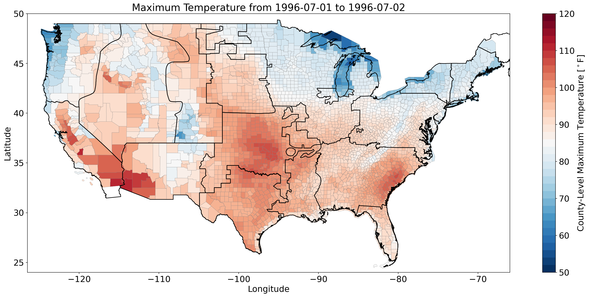  | 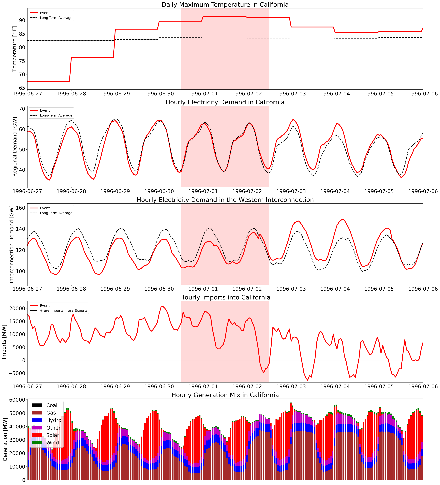  |
| Seasonal Timing | ST2-CA  |    California     | 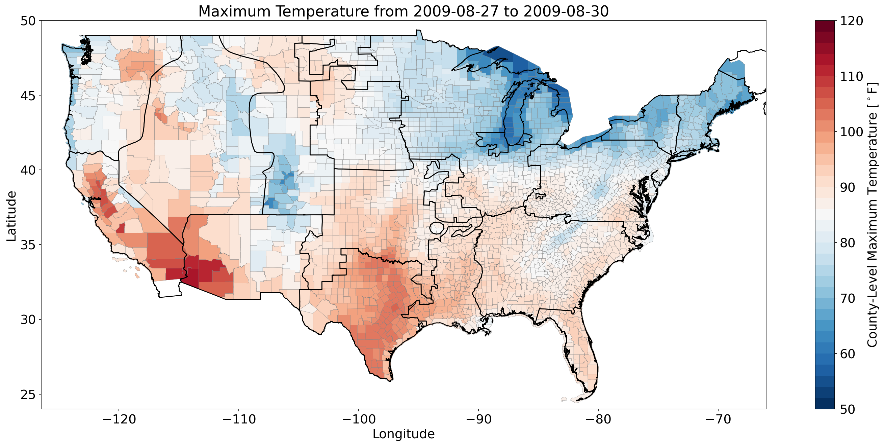  | 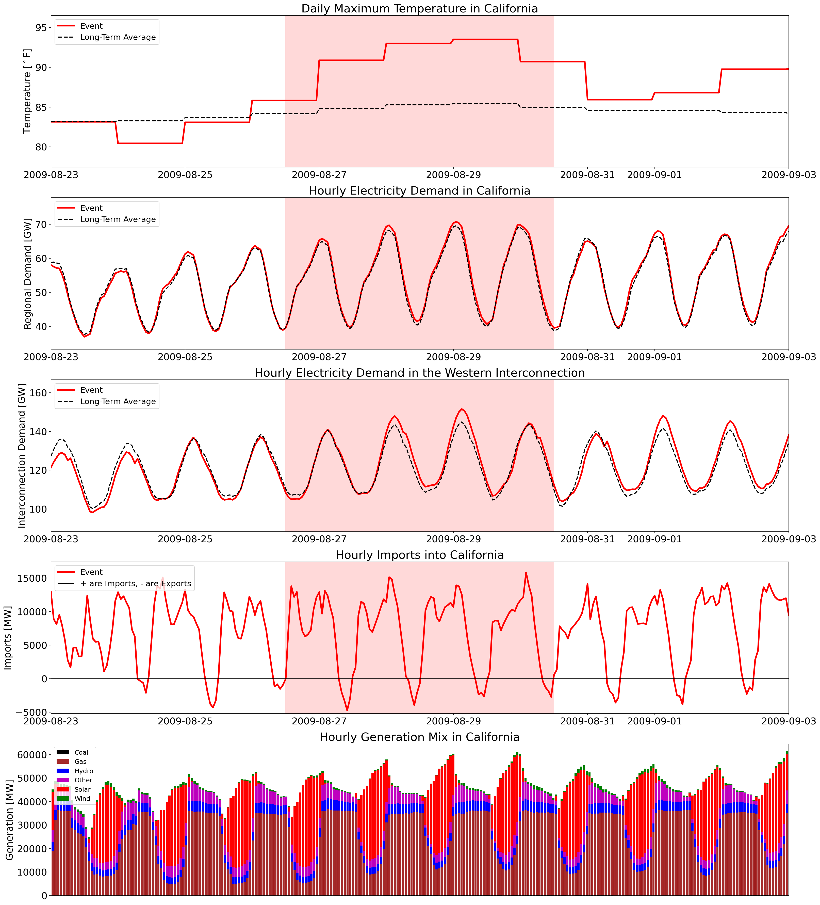  |
| Spatial Extent  | SE1-PNW | Pacific Northwest | 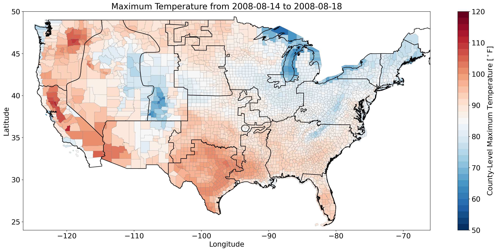 | 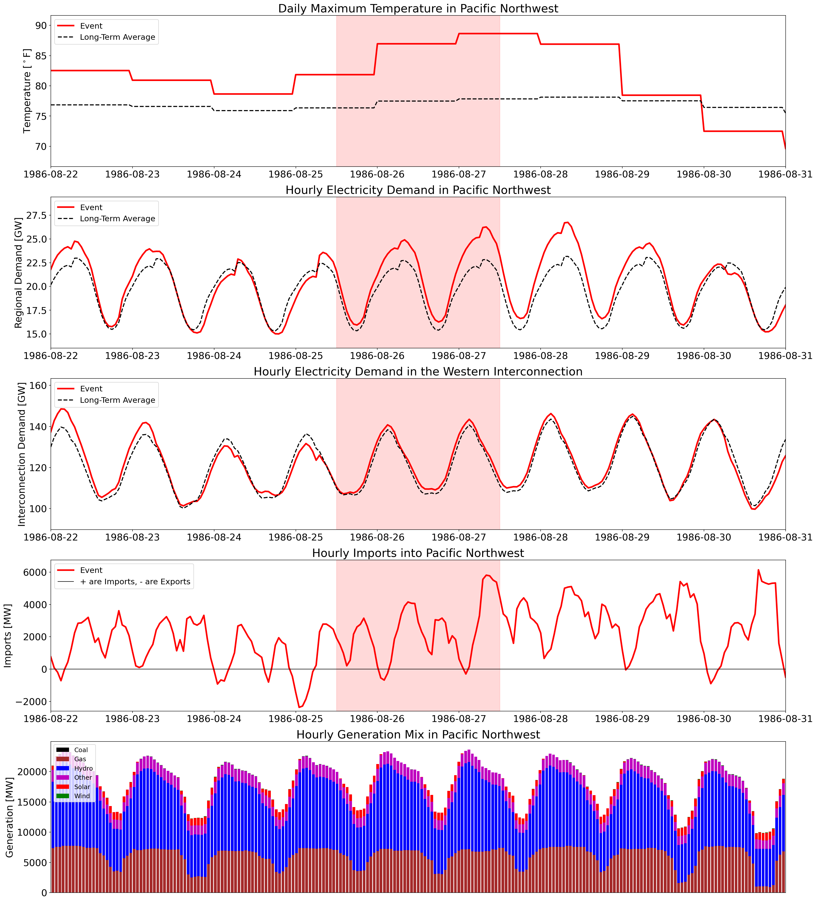 | 
| Spatial Extent  | SE2-PNW | Pacific Northwest | 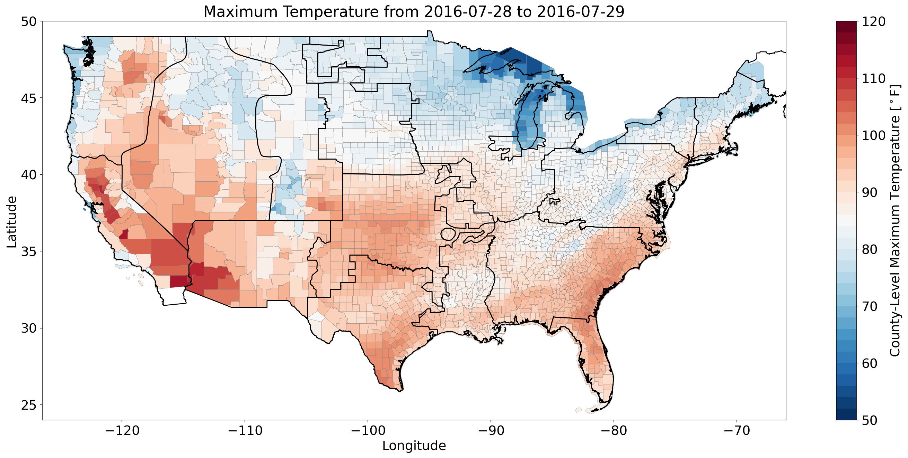 | 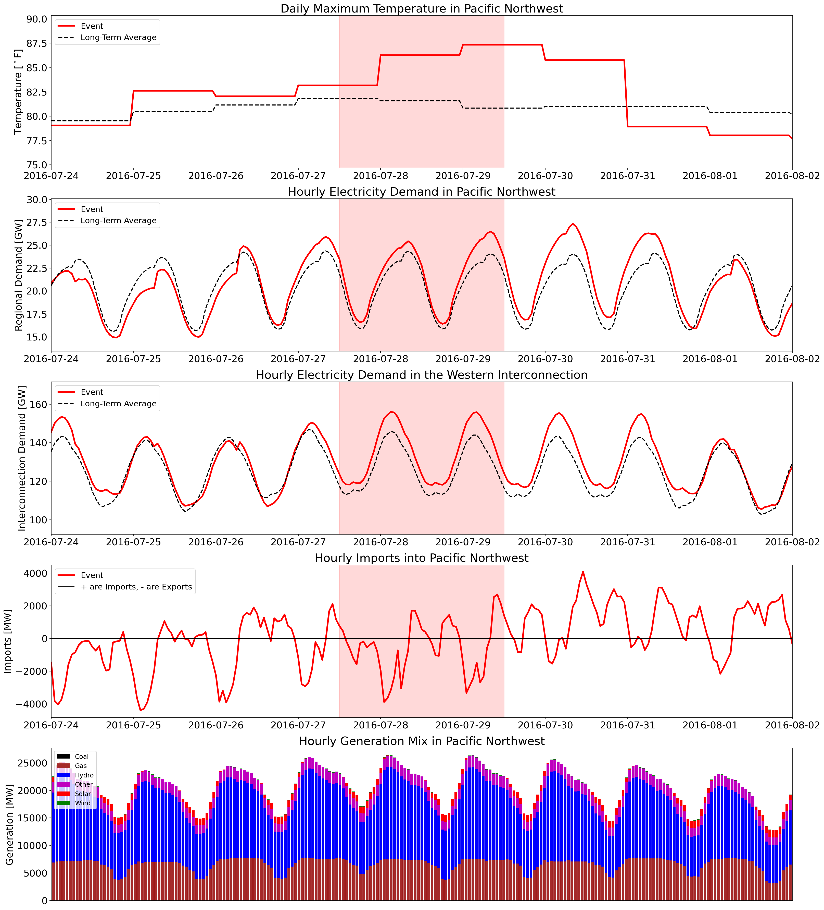 | 
| Event Duration  | ED1-GB  |    Great Basin    | 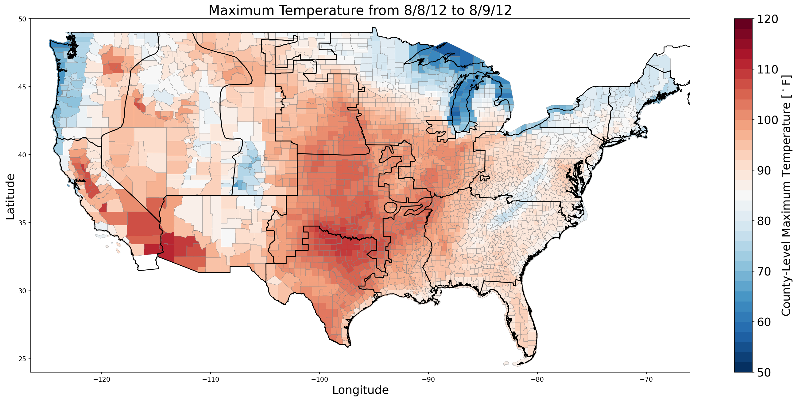  | 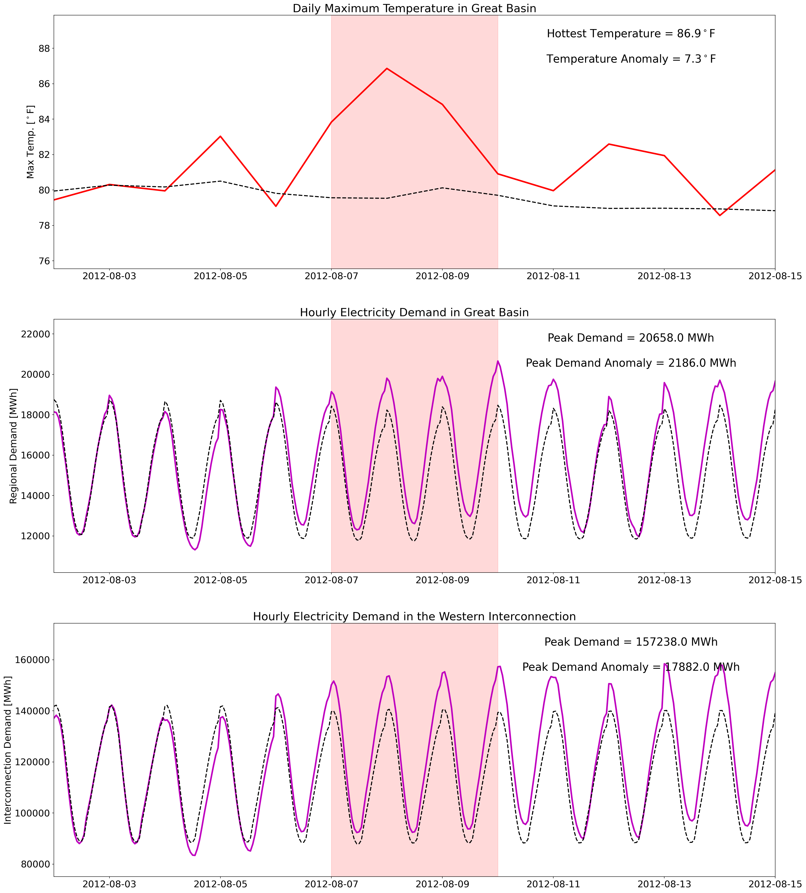  |
| Event Duration  | ED2-GB  |    Great Basin    | 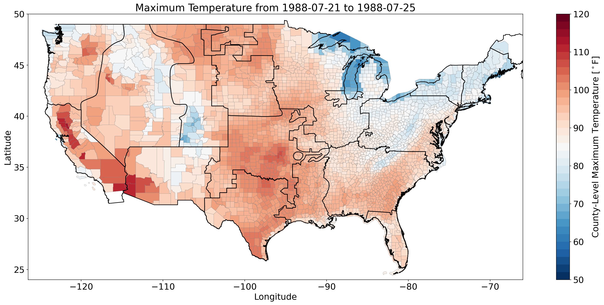  | 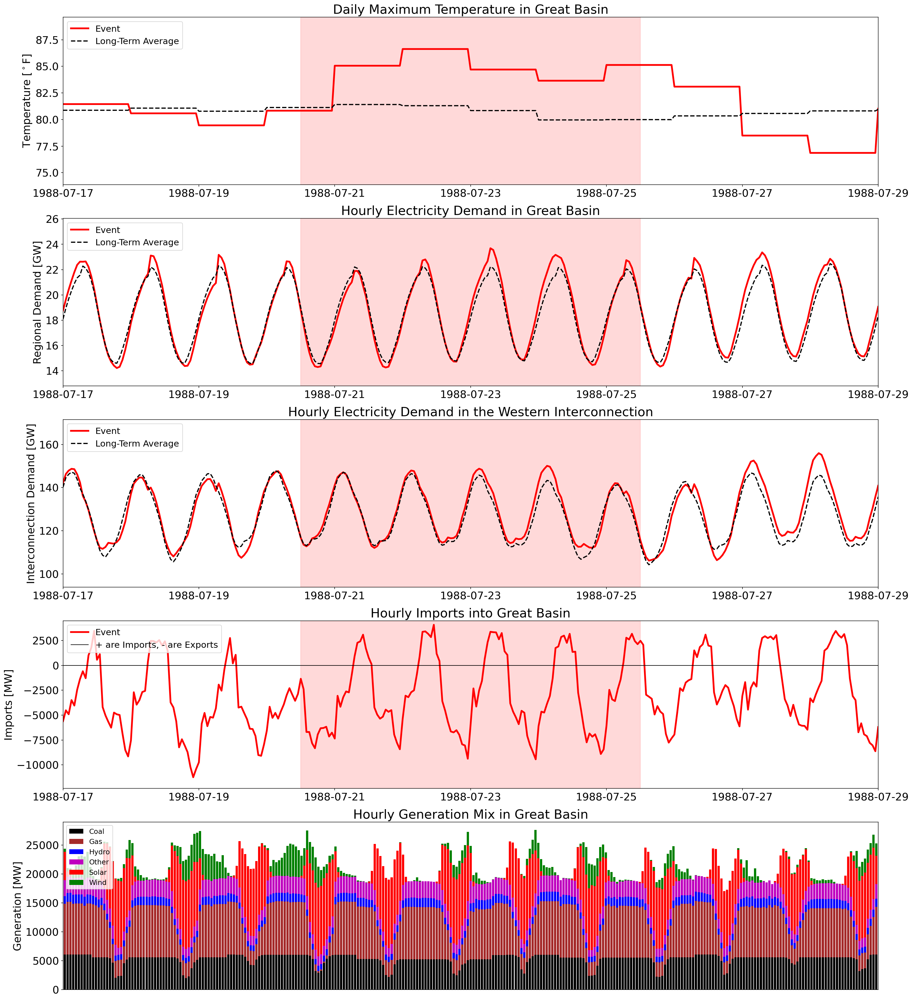  |